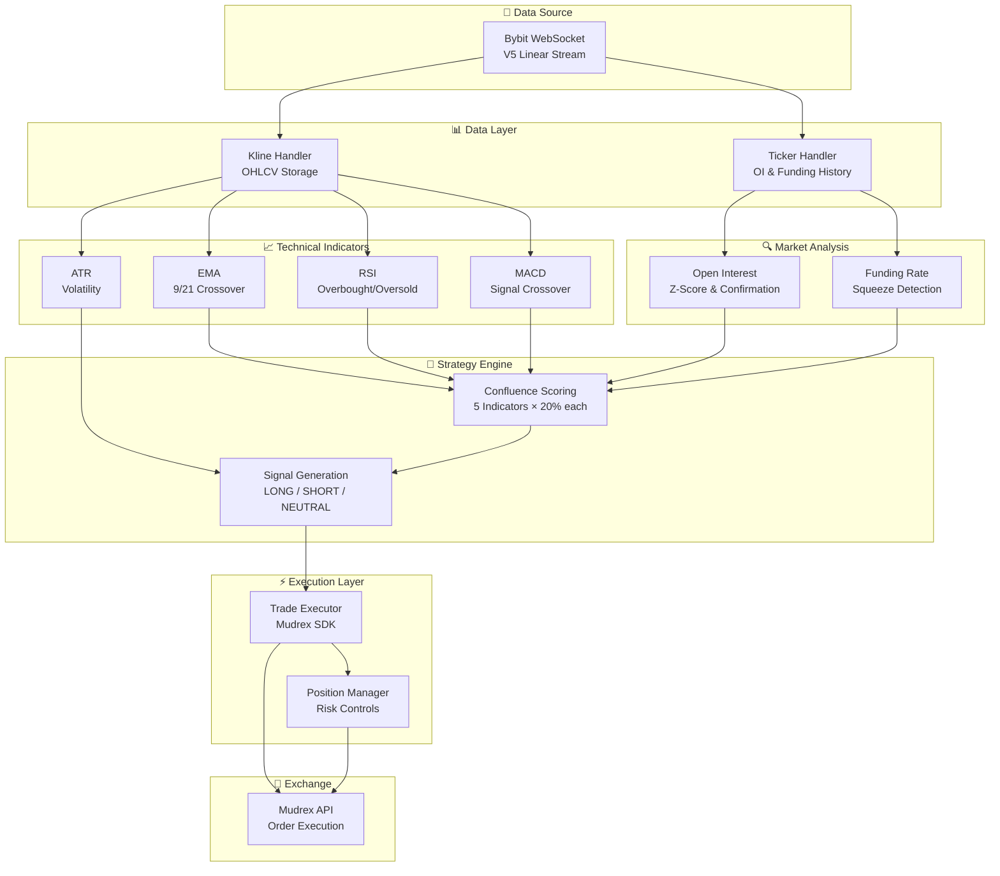

```text
███████╗██████╗ ███████╗███████╗
██╔════╝██╔══██╗██╔════╝██╔════╝
█████╗  ██████╔╝█████╗  █████╗  
██╔══╝  ██╔══██╗██╔══╝  ██╔══╝  
██║     ██║  ██║███████╗███████╗
╚═╝     ╚═╝  ╚═╝╚══════╝╚══════╝
                                
██╗    ██╗███████╗██╗ ██████╗ ██╗  ██╗████████╗
██║    ██║██╔════╝██║██╔════╝ ██║  ██║╚══██╔══╝
██║ █╗ ██║█████╗  ██║██║  ███╗███████║   ██║   
██║███╗██║██╔══╝  ██║██║   ██║██╔══██║   ██║   
╚███╔███╔╝███████╗██║╚██████╔╝██║  ██║   ██║   
 ╚══╝╚══╝ ╚══════╝╚═╝ ╚═════╝ ╚═╝  ╚═╝   ╚═╝   
                                               
███████╗████████╗██████╗  █████╗ ████████╗███████╗ ██████╗ ██╗   ██╗
██╔════╝╚══██╔══╝██╔══██╗██╔══██╗╚══██╔══╝██╔════╝██╔════╝ ╚██╗ ██╔╝
███████╗   ██║   ██████╔╝███████║   ██║   █████╗  ██║  ███╗ ╚████╔╝ 
╚════██║   ██║   ██╔══██╗██╔══██║   ██║   ██╔══╝  ██║   ██║  ╚██╔╝  
███████║   ██║   ██║  ██║██║  ██║   ██║   ███████╗╚██████╔╝   ██║   
╚══════╝   ╚═╝   ╚═╝  ╚═╝╚═╝  ╚═╝   ╚═╝   ╚══════╝ ╚═════╝    ╚═╝   
```
> **Advanced Multi-Strategy Crypto Bot for Mudrex & Bybit**

An advanced multi-indicator confluence trading strategy for crypto perpetual futures using Mudrex API and real-time Bybit WebSocket data.

---

## Architecture

### System Flow



### Detailed Architecture

```
┌─────────────────────────────────────────────────────────────────────────────┐
│                           FREE WEIGHT STRATEGY                              │
├─────────────────────────────────────────────────────────────────────────────┤
│                                                                             │
│   ┌───────────────────────┐         ┌────────────────────────────────────┐  │
│   │   BYBIT WEBSOCKET     │         │        MUDREX API                  │  │
│   │   (Real-Time Data)    │         │     (Order Execution)              │  │
│   │                       │         │                                    │  │
│   │  • Kline/Candlestick  │         │  • Market Orders                   │  │
│   │  • Ticker/Price       │         │  • Stop-Loss/Take-Profit           │  │
│   │  • Open Interest      │         │  • Position Management             │  │
│   │  • Funding Rate       │         │  • Balance/Wallet                  │  │
│   └───────────┬───────────┘         └──────────────┬─────────────────────┘  │
│               │                                    ▲                        │
│               ▼                                    │                        │
│   ┌───────────────────────────────────────────────────────────────────────┐ │
│   │                         DATA HANDLERS                                 │ │
│   │   ┌─────────────────────┐    ┌─────────────────────────────────────┐  │ │
│   │   │   Kline Handler     │    │      Ticker Handler                 │  │ │
│   │   │   • OHLCV storage   │    │   • Price updates                   │  │ │
│   │   │   • History buffer  │    │   • OI history tracking             │  │ │
│   │   │   • Candle confirm  │    │   • Funding rate history            │  │ │
│   │   └─────────┬───────────┘    └─────────────────┬───────────────────┘  │ │
│   └─────────────┼──────────────────────────────────┼──────────────────────┘ │
│                 │                                  │                        │
│                 ▼                                  ▼                        │
│   ┌───────────────────────────────────────────────────────────────────────┐ │
│   │                      TECHNICAL INDICATORS                             │ │
│   │                                                                       │ │
│   │   ┌─────────────┐ ┌─────────────┐ ┌─────────────┐ ┌─────────────────┐ │ │
│   │   │     EMA     │ │     RSI     │ │    MACD     │ │      ATR        │ │ │
│   │   │  (9 & 21)   │ │   (14)      │ │ (12/26/9)   │ │     (14)        │ │ │
│   │   │             │ │             │ │             │ │                 │ │ │
│   │   │ • Crossover │ │ • Oversold  │ │ • Crossover │ │ • Volatility    │ │ │
│   │   │ • Trend     │ │ • Overbought│ │ • Histogram │ │ • Dynamic SL/TP │ │ │
│   │   └──────┬──────┘ └──────┬──────┘ └──────┬──────┘ └────────┬────────┘ │ │
│   └──────────┼───────────────┼───────────────┼─────────────────┼──────────┘ │
│              │               │               │                 │            │
│              ▼               ▼               ▼                 ▼            │
│   ┌───────────────────────────────────────────────────────────────────────┐ │
│   │                       MARKET DATA ANALYZERS                           │ │
│   │                                                                       │ │
│   │   ┌─────────────────────────────┐  ┌────────────────────────────────┐ │ │
│   │   │     OPEN INTEREST (OI)      │  │       FUNDING RATE             │ │ │
│   │   │                             │  │                                │ │ │
│   │   │  • Z-Score calculation      │  │  • Sentiment analysis          │ │ │
│   │   │  • Trend confirmation       │  │  • Squeeze detection           │ │ │
│   │   │  • Extreme detection        │  │  • Annualized rate             │ │ │
│   │   └──────────────┬──────────────┘  └───────────────┬────────────────┘ │ │
│   └──────────────────┼─────────────────────────────────┼──────────────────┘ │
│                      │                                 │                    │
│                      ▼                                 ▼                    │
│   ┌───────────────────────────────────────────────────────────────────────┐ │
│   │                        STRATEGY ENGINE                                │ │
│   │                                                                       │ │
│   │   ┌──────────────────────────────────────────────────────────────┐    │ │
│   │   │                  CONFLUENCE SCORING                          │    │ │
│   │   │                                                              │    │ │
│   │   │   ┌─────────┐ ┌─────────┐ ┌─────────┐ ┌─────────┐ ┌────────┐ │    │ │
│   │   │   │ EMA 20% │ │ RSI 20% │ │MACD 20% │ │ OI 20%  │ │FR 20%  │ │    │ │
│   │   │   └────┬────┘ └────┬────┘ └────┬────┘ └────┬────┘ └───┬────┘ │    │ │
│   │   │        └───────────┴───────────┴───────────┴──────────┘      │    │ │
│   │   │                            │                                 │    │ │
│   │   │                            ▼                                 │    │ │
│   │   │                  Total Score: 0-100%                         │    │ │
│   │   │                                                              │    │ │
│   │   │         Entry Threshold: ≥60% AND ≥3/5 indicators            │    │ │
│   │   └──────────────────────────────────────────────────────────────┘    │ │
│   │                                                                       │ │
│   │   ┌──────────────────────────────────────────────────────────────┐    │ │
│   │   │                    SIGNAL GENERATION                         │    │ │
│   │   │                                                              │    │ │
│   │   │   • Signal Type: LONG / SHORT / NEUTRAL                      │    │ │
│   │   │   • Entry Price (current market)                             │    │ │
│   │   │   • Stop-Loss (ATR × 1.5)                                    │    │ │
│   │   │   • Take-Profit (Risk:Reward = 2:1)                          │    │ │
│   │   │   • Position Size (max 2% capital)                           │    │ │
│   │   └──────────────────────────────┬───────────────────────────────┘    │ │
│   └──────────────────────────────────┼────────────────────────────────────┘ │
│                                      │                                      │
│                                      ▼                                      │
│   ┌───────────────────────────────────────────────────────────────────────┐ │
│   │                        TRADE EXECUTION                                │ │
│   │                                                                       │ │
│   │   ┌─────────────────────────────┐  ┌────────────────────────────────┐ │ │
│   │   │      TRADE EXECUTOR         │  │      POSITION MANAGER          │ │ │
│   │   │                             │  │                                │ │ │
│   │   │  • Live/Dry-run mode        │  │  • Track open positions        │ │ │
│   │   │  • Quantity calculation     │  │  • Max positions per symbol    │ │ │
│   │   │  • Order placement          │  │  • PnL monitoring              │ │ │
│   │   │  • Minimum order validation │  │  • Risk limit enforcement      │ │ │
│   │   │  • Mudrex SDK integration   │  │  • Exchange sync               │ │ │
│   │   └─────────────────────────────┘  └────────────────────────────────┘ │ │
│   └───────────────────────────────────────────────────────────────────────┘ │
│                                                                             │
└─────────────────────────────────────────────────────────────────────────────┘
```

---

## Project Structure

```
free-weight-strategy-mudrex-api/
├── src/
│   ├── __init__.py
│   ├── main.py                    # Main entry point
│   ├── config.py                  # Configuration loader
│   │
│   ├── bybit_ws/                  # Real-time data
│   │   ├── __init__.py
│   │   ├── client.py              # WebSocket client
│   │   └── handlers.py            # Data handlers
│   │
│   ├── indicators/                # Technical analysis
│   │   ├── __init__.py
│   │   ├── ema.py                 # EMA crossover
│   │   ├── rsi.py                 # RSI momentum
│   │   ├── macd.py                # MACD confirmation
│   │   └── atr.py                 # ATR volatility
│   │
│   ├── market_data/               # Derivatives metrics
│   │   ├── __init__.py
│   │   ├── open_interest.py       # OI analysis
│   │   └── funding_rate.py        # Funding analysis
│   │
│   ├── strategy/                  # Signal generation
│   │   ├── __init__.py
│   │   ├── engine.py              # Confluence engine
│   │   └── signals.py             # Signal models
│   │
│   ├── trading/                   # Order execution
│   │   ├── __init__.py
│   │   ├── executor.py            # Mudrex integration
│   │   └── position_manager.py    # Position tracking
│   │
│   └── utils/
│       ├── __init__.py
│       └── logger.py              # Logging config
│
├── tests/
│   ├── __init__.py
│   ├── test_indicators.py
│   └── test_strategy.py
│
├── config.example.yaml            # Config template
├── .env.example                   # Environment variables
├── requirements.txt               # Dependencies
└── README.md
```

---

## Installation

### 1. Clone Repository

```bash
git clone https://github.com/DecentralizedJM/free-weight-strategy-mudrex-api.git
cd free-weight-strategy-mudrex-api
```

### 2. Install Dependencies

```bash
pip install -r requirements.txt
```

### 3. Configure

```bash
# Copy templates
cp config.example.yaml config.yaml
cp .env.example .env

# Edit .env with your API secret
MUDREX_API_SECRET=your_api_secret_here
DRY_RUN=true  # Start with dry-run mode
```

### 4. Run

```bash
# Dry-run (paper trading)
python -m src.main --dry-run

# Live trading
python -m src.main

# With custom config
python -m src.main --config path/to/config.yaml
```

---

## Strategy Details

### Indicator Weights

Each indicator contributes 20% to the total confluence score:

| Indicator | Weight | Long Condition | Short Condition |
|-----------|--------|----------------|-----------------|
| **EMA** | 20% | Fast (9) > Slow (21) | Fast (9) < Slow (21) |
| **RSI** | 20% | < 40 and recovering | > 60 and falling |
| **MACD** | 20% | MACD > Signal line | MACD < Signal line |
| **Open Interest** | 20% | Rising + Price rising | Rising + Price falling |
| **Funding Rate** | 20% | Short squeeze risk | Long squeeze risk |

### Entry Conditions

A trade signal is generated when:
- **Confluence Score ≥ 60%** (at least 3 indicators aligned)
- **Minimum 3 out of 5 indicators** confirm the direction
- **Trade cooldown** period (5 minutes) has passed
- **No existing position** in the same direction

### Signal Types

| Signal | Action | Conditions |
|--------|--------|------------|
| **LONG** | Open long position | Bullish confluence ≥ 60% |
| **SHORT** | Open short position | Bearish confluence ≥ 60% |
| **NEUTRAL** | No action | Confluence < 60% or indicators mixed |

---

## Risk Management

### Position Sizing

```
Position Value = Available Balance × Risk % × Leverage
Quantity = Position Value / Entry Price
```

- **Max capital per trade**: 2%
- **Default leverage**: 5x (configurable)
- **Max positions per symbol**: 1

### Dynamic Stop-Loss (ATR-Based)

```
Long SL  = Entry Price - (ATR × 1.5)
Short SL = Entry Price + (ATR × 1.5)
```

### Take-Profit (Risk:Reward Ratio)

```
Risk Distance = |Entry - Stop-Loss|
TP Distance = Risk Distance × 2.0  (2:1 R:R)

Long TP  = Entry Price + TP Distance
Short TP = Entry Price - TP Distance
```

---

## Configuration Reference

### `config.yaml`

```yaml
# Symbols to trade
symbols:
  - BTCUSDT
  - ETHUSDT

# Timeframe in minutes
timeframe: 5

# Indicator settings
indicators:
  ema:
    fast_period: 9
    slow_period: 21
  rsi:
    period: 14
    oversold: 30
    overbought: 70
  macd:
    fast_period: 12
    slow_period: 26
    signal_period: 9
  atr:
    period: 14

# Strategy parameters
strategy:
  min_confluence_score: 60
  min_indicators_aligned: 3
  trade_cooldown: 300  # seconds
  max_positions_per_symbol: 1

# Risk management
risk:
  max_capital_per_trade: 2.0  # percent
  default_leverage: 5
  stoploss_atr_multiplier: 1.5
  takeprofit_ratio: 2.0
```

### Environment Variables

| Variable | Required | Default | Description |
|----------|----------|---------|-------------|
| `MUDREX_API_SECRET` | Yes (live) | - | Mudrex API secret |
| `DRY_RUN` | No | `false` | Paper trading mode |
| `LOG_LEVEL` | No | `INFO` | Logging verbosity |

---

## Testing

```bash
# Run all tests
pytest tests/ -v

# Run specific test file
pytest tests/test_indicators.py -v

# Run with coverage
pytest tests/ --cov=src
```

---

## Data Flow

1. **Bybit WebSocket** streams real-time kline and ticker data
2. **Handlers** parse and store OHLCV, OI, and funding rate history
3. **Indicators** calculate EMA, RSI, MACD, ATR on each candle close
4. **Market Analyzers** compute OI z-score and funding sentiment
5. **Strategy Engine** evaluates confluence and generates signals
6. **Trade Executor** places orders via Mudrex API (or simulates in dry-run)
7. **Position Manager** tracks open positions and enforces risk limits

---

## API Integration

### Bybit (Data Source)

- **Endpoint**: `wss://stream.bybit.com/v5/public/linear`
- **Subscriptions**:
  - `kline.{interval}.{symbol}` - Candlestick data
  - `tickers.{symbol}` - Price, OI, funding rate

### Mudrex (Execution)

- **SDK**: `mudrex-api-trading-python-sdk`
- **Features**:
  - Symbol-first trading (e.g., "BTCUSDT")
  - Market orders with SL/TP
  - Leverage management
  - Position tracking

---

## Logging

Logs are written to console and optionally to file:

```
2025-02-09 18:45:23 | INFO     | src.main | WebSocket connected - Receiving market data
2025-02-09 18:45:24 | INFO     | src.strategy.engine | SIGNAL: BTCUSDT LONG | Score: 80% | Aligned: 4/5
2025-02-09 18:45:24 | INFO     | src.trading.executor | ✅ Trade executed: LONG 0.001 BTCUSDT @ market
```

Configure in `config.yaml`:
```yaml
logging:
  level: INFO
  file: logs/trading.log
  max_size: 10  # MB
  backup_count: 5
```

---

## License

MIT License

---

## Disclaimer

⚠️ **This software is for educational purposes only.** Trading cryptocurrencies involves significant risk. Use at your own risk. The authors are not responsible for any financial losses.
